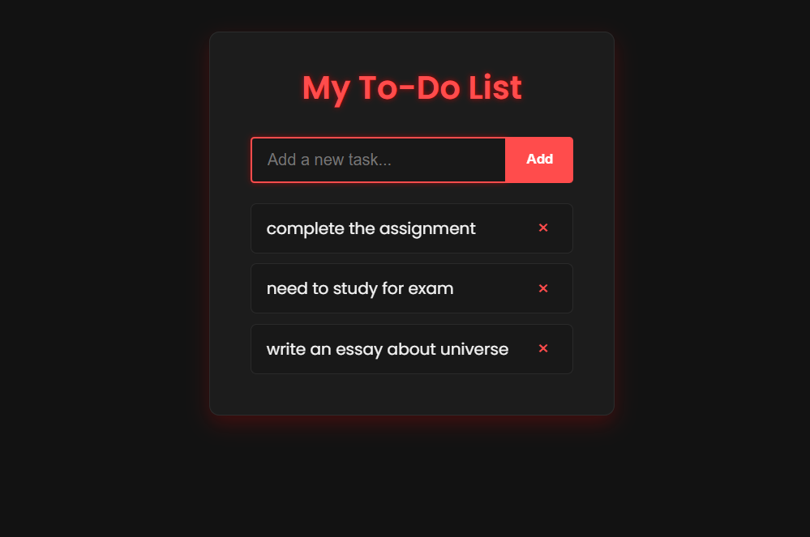

# MWAD-EX_03-To-Do-List-using-JavaScript
## Date: 10-11-2025

## AIM
To create a To-do Application with all features using JavaScript.

## ALGORITHM
### STEP 1
Build the HTML structure (index.html).

### STEP 2
Style the App (style.css).

### STEP 3
Plan the features the To-Do App should have.

### STEP 4
Create a To-do application using Javascript.

### STEP 5
Add functionalities.

### STEP 6
Test the App.

### STEP 7
Open the HTML file in a browser to check layout and functionality.

### STEP 8
Fix styling issues and refine content placement.

### STEP 9
Deploy the website.

### STEP 10
Upload to GitHub Pages for free hosting.

## PROGRAM

### index.html

```

<!DOCTYPE html>
<html lang="en">
  <head>
    <meta charset="UTF-8" />
    <meta name="viewport" content="width=device-width, initial-scale=1" />
    <title>Simple To-Do App</title>
    <link rel="stylesheet" href="style.css" />
  </head>
  <body>
    <div class="app-container">
      <h1>My To-Do List</h1>
      <form id="todo-form">
        <input
          type="text"
          id="todo-input"
          placeholder="Add a new task..."
          autocomplete="off"
        />
        <button type="submit">Add</button>
      </form>
      <ul id="todo-list"></ul>
    </div>
    <script src="script.js"></script>
  </body>
</html>

```

### style.css

```
@import url('https://fonts.googleapis.com/css2?family=Poppins:wght@300;400;500;600&display=swap');

* {
  box-sizing: border-box;
  margin: 0;
  padding: 0;
}

body {
  font-family: "Poppins", sans-serif;
  background-color: #121212; /* dark background */
  color: #f5f5f5;
  display: flex;
  justify-content: center;
  align-items: flex-start;
  height: 100vh;
  padding: 40px 20px;
}

.app-container {
  background: #1c1c1c;
  padding: 30px 40px;
  border-radius: 10px;
  box-shadow: 0 8px 20px rgba(255, 0, 0, 0.2);
  width: 100%;
  max-width: 400px;
  border: 1px solid #2c2c2c;
}

h1 {
  margin-bottom: 25px;
  color: #ff4c4c; /* bright red highlight */
  text-align: center;
  font-weight: 600;
  text-shadow: 0 0 6px rgba(255, 0, 0, 0.6);
}

#todo-form {
  display: flex;
  margin-bottom: 20px;
}

#todo-input {
  flex-grow: 1;
  padding: 12px 15px;
  border: 2px solid #2a2a2a;
  border-radius: 4px 0 0 4px;
  font-size: 16px;
  background-color: #181818;
  color: #fff;
  outline: none;
  transition: border-color 0.3s, box-shadow 0.3s;
}

#todo-input:focus {
  border-color: #ff4c4c;
  box-shadow: 0 0 6px rgba(255, 0, 0, 0.4);
}

#todo-form button {
  padding: 12px 20px;
  border: none;
  background-color: #ff4c4c;
  color: white;
  font-weight: bold;
  cursor: pointer;
  border-radius: 0 4px 4px 0;
  transition: background-color 0.3s, box-shadow 0.3s;
}

#todo-form button:hover {
  background-color: #e00000;
  box-shadow: 0 0 10px rgba(255, 0, 0, 0.5);
}

#todo-list {
  list-style: none;
}

#todo-list li {
  padding: 12px 15px;
  background-color: #181818;
  border: 1px solid #2a2a2a;
  border-radius: 6px;
  margin-bottom: 10px;
  display: flex;
  justify-content: space-between;
  align-items: center;
  transition: background-color 0.3s, transform 0.2s;
}

#todo-list li:hover {
  transform: scale(1.02);
  background-color: #202020;
}

#todo-list li.completed {
  text-decoration: line-through;
  color: #ff7777;
  background-color: #2a0000;
  border-color: #ff4c4c;
}

.todo-text {
  flex-grow: 1;
  cursor: pointer;
}

.delete-btn {
  background: transparent;
  border: none;
  color: #ff4c4c;
  font-size: 20px;
  cursor: pointer;
  padding: 0 8px;
  line-height: 1;
  transition: color 0.3s, transform 0.2s;
}

.delete-btn:hover {
  color: #ff0000;
  transform: scale(1.2);
}


```

### script.js

```
const form = document.getElementById("todo-form");
const input = document.getElementById("todo-input");
const todoList = document.getElementById("todo-list");

form.addEventListener("submit", function (event) {
  event.preventDefault();

  const taskText = input.value.trim();
  if (taskText === "") return;

  const li = document.createElement("li");

  const span = document.createElement("span");
  span.className = "todo-text";
  span.textContent = taskText;

  span.addEventListener("click", () => {
    li.classList.toggle("completed");
  });

  const deleteBtn = document.createElement("button");
  deleteBtn.className = "delete-btn";
  deleteBtn.textContent = "×";

  deleteBtn.addEventListener("click", () => {
    todoList.removeChild(li);
  });

  li.appendChild(span);
  li.appendChild(deleteBtn);
  todoList.appendChild(li);

  input.value = "";
  input.focus();

  window.addEventListener("beforeunload", function (e) {
    e.preventDefault();
    e.returnValue = ""; 
  });
});

```
## OUTPUT


## RESULT
The program for creating To-do list using JavaScript is executed successfully.
